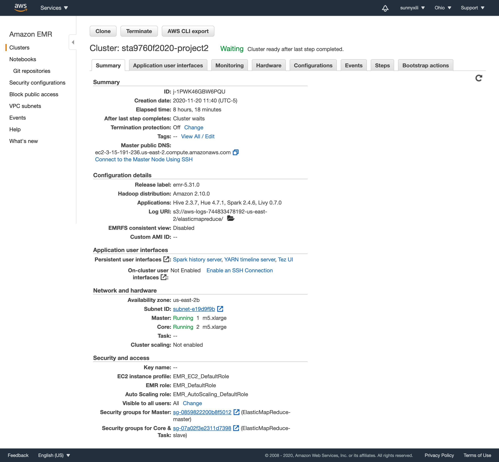
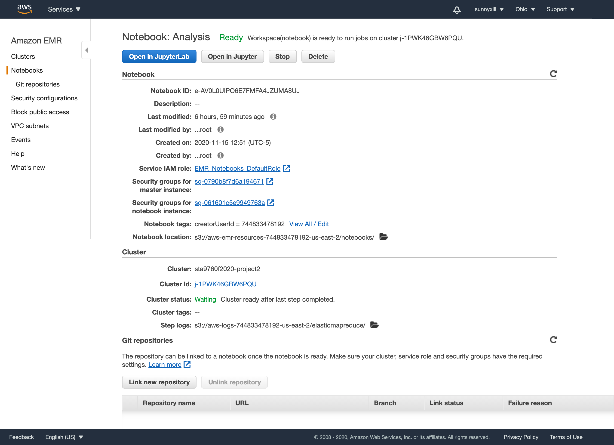



## Analyzing 10Gb of Yelp Reviews Data

**Context**

I used my understanding of how to leverage transformations and actions (as per the Spark terminology) with **PySpark** in performing basic data analysis tasks on information sources that are too large to manage in memory  on AWS EMR,connect it to a Jupyter Notebook and then run a series of queries (in python with DataFrame API or Spark SQL).

**Analysis**

**All the analysis is in the file project02 -> Analysis.py OR Analysis.pdf**

I analyzed a subset of Yelp's business, reviews and user data. This dataset comes to me from [Kaggle](https://www.kaggle.com/yelp-dataset/yelp-dataset) although I have taken steps to pull this data into a public s3 bucket:  s3://sta9760-project2-dataset/yelp\_academic\_dataset_business.json,  s3://sta9760-project2-dataset/yelp\_academic\_dataset_review.json,  s3://sta9760-project2-dataset/yelp\_academic\_dataset_user.json

## Cluster and Notebook Configs

## Cluster and Notebook Configs

